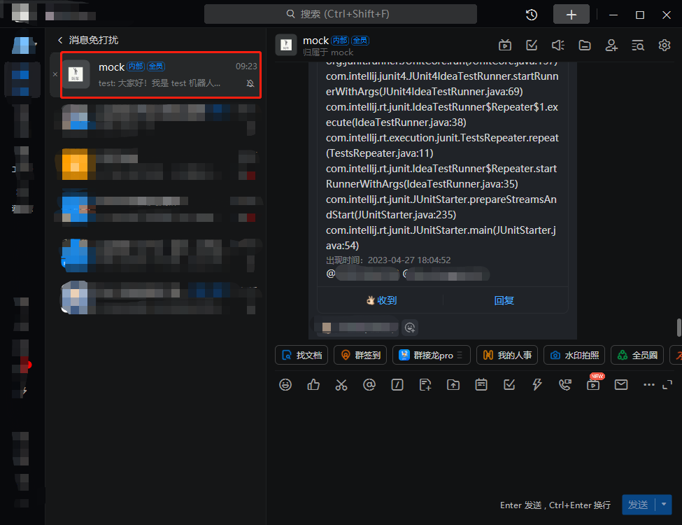
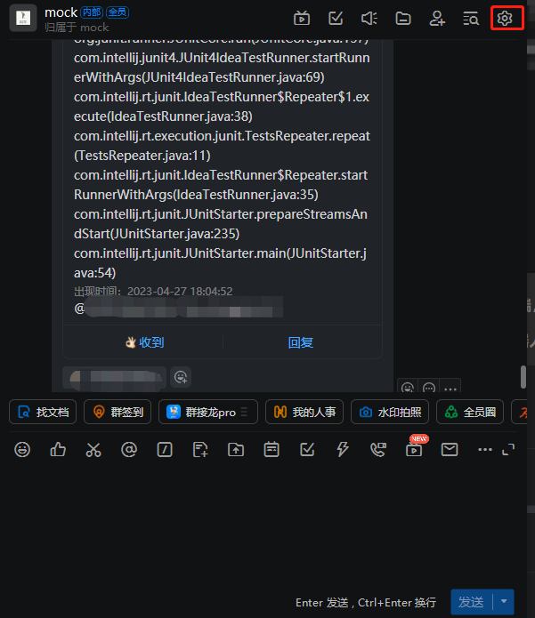
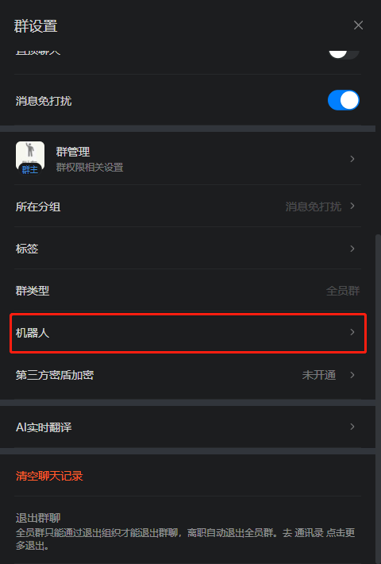
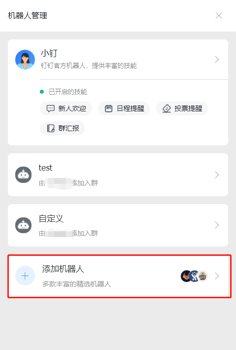
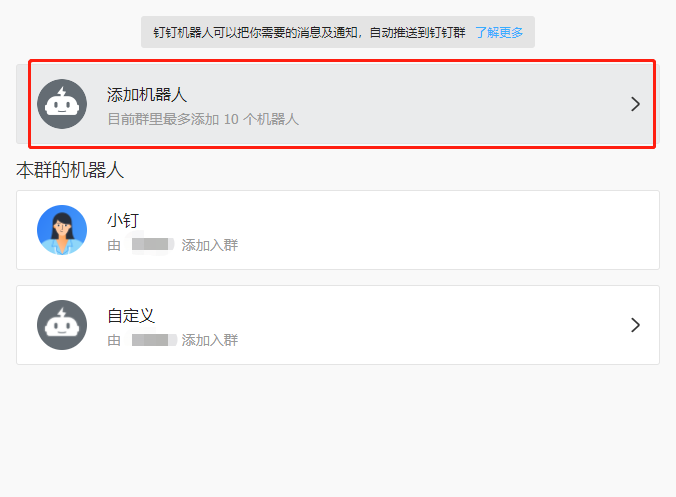
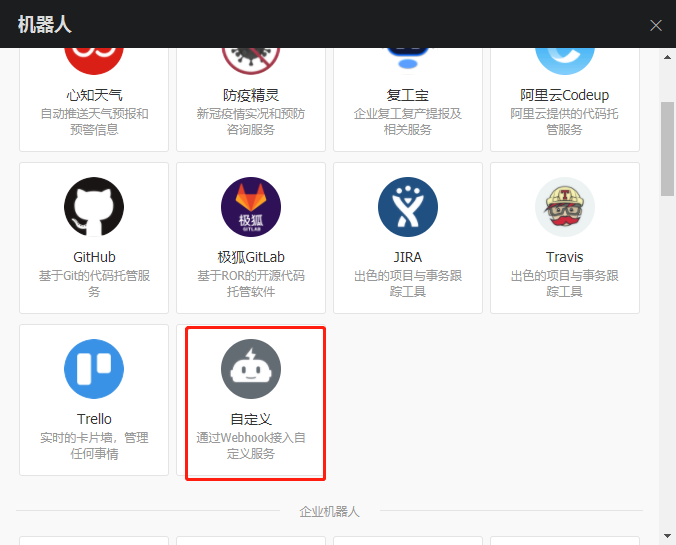
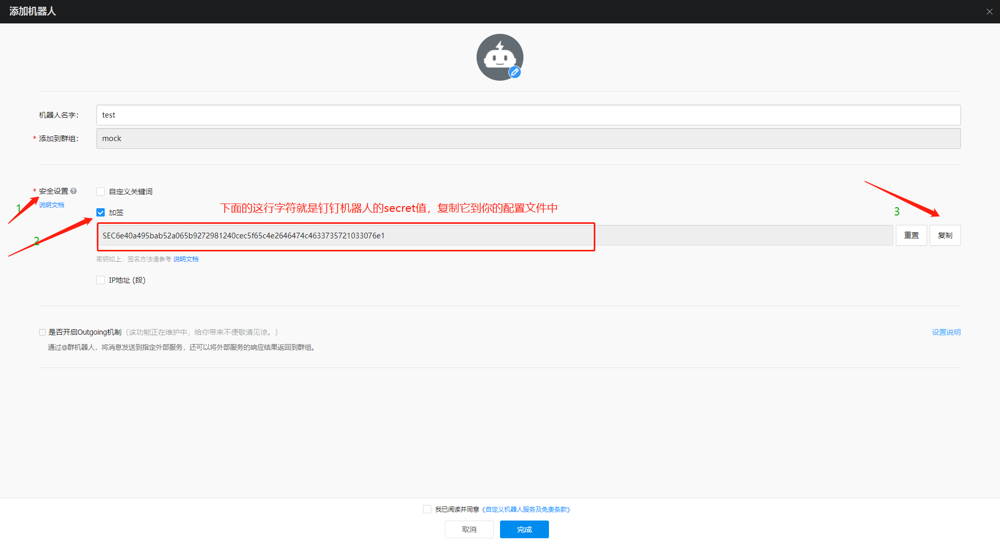
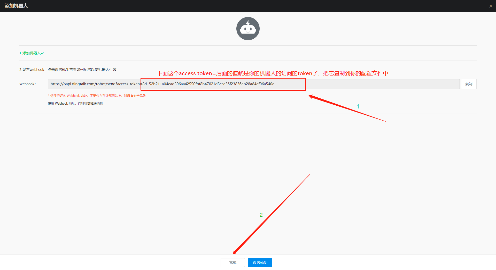
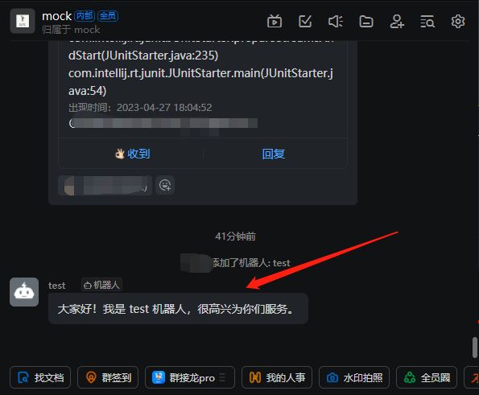

#### 基于SpringAOP的异常通知spring-boot-starter

**介绍**

本项目是适用于企业开发，个人开发者，在平时开发中这个项目可能一点忙都帮不上你，但是当你的项目开发完成并且上线之后，它的作用就发挥出来了，因为它将代替你监控你的工程
，在你不想去24小时不停盯着日志看是否报错的时候，在你下班或者休息的时间帮你照看你的项目， 直到它发生异常的时候，它将精准的把异常通过手机短信/钉钉来通知你项目的异常情况，这让你可以
在项目上线之后无需在让人一直守着它，甚至如果项目出问题的时候可以将锅直接甩到负责人身上， 而无需在它出异常的时候再去定位异常找出是谁写的，然后再通知他，这样效率很低，而本项目可以 自动化的将所有这一切令人不爽的工作自动化的处理，省时省力。

系统需求：      

**快速入门**

1.在你的工程的pom文件中将以下依赖加入

```xml
<dependency>
    <groupId>io.github.marvinspring</groupId>
    <artifactId>spring-boot-starter-calma</artifactId>
    <version>1.0.6.RELEASE</version>
</dependency>
```

2.在SpringBoot的配置文件：application.yml中做如下的配置：

```yaml
spring:
  application:
    name: #项目名称，这里和project-name都可以给项目配置名称
calma:
  exceptionnotice:
    enabled: true #开启异常通知
    listen-type: common #普通模式
    project-name: a example project #项目名称
  #Sms配置
  #  sms:
  #    enable: true #开启短信通知
  #    regionId: 阿里云短信的regionId
  #    accessKey: 阿里云短信的accessKey
  #    secret: 阿里云短信的密钥
  #    phoneNumbers: 你的手机号
  #    signName: 阿里云短信的签名
  #    templateCode: 阿里云短信的模板码
  #钉钉
  dingding:
    enable: true #开启钉钉通知
    msgtype: text #发送的消息格式,text将通过普通文本方式发送，markdown将会将异常信息用markdown语法转化后发送
    phoneNumbers: #要@的人的手机号,格式为：136xxxxxxxx,159xxxxxxxx
    userIds: #要@的人的钉钉id，格式为：xxx,xxxx
    isAtAll: true #true 通知全体成员，false则不
    access_token: #钉钉机器人的token
    secret: #钉钉机器人的密钥
```

3.首先在你的项目中写如下案例

```java

@Component//由于common方式通知实现是由spring aop方式实现，这里它必须被装载到spring中
@CalmaExceptionListener // 异常通知的监控来自这个注解
public class ExceptionTest {

    //@CalmaExceptionListener当然标注在某个方法上面就只监控被标注的方法
    public void testException(String param) {
        System.out.println("参数：" + param);
        throw new IllegalArgumentException("异常");
    }

}

```

4.测试

```java

@RunWith(SpringRunner.class)
@SpringBootTest
public class DemoApplicationTests {

    @Autowired
    private ExceptionTest exceptionTest;

    @Test
    public void contextLoads() {
        exceptionTest.testException("冲冲冲！");
    }
}
```
然后你的钉钉就会钉d=====(￣▽￣*)b的一声


到这里测试就完成了，可以快乐的当一个帅锅侠了

--------------------------------------------------------------------

从这开始讲解如何在web模式下使用本框架

1.在你的工程的pom文件中将以下依赖加入

```xml
<dependency>
    <groupId>io.github.marvinspring</groupId>
    <artifactId>spring-boot-starter-calma</artifactId>
    <version>1.0.6.RELEASE</version>
</dependency>
```

2.在SpringBoot的配置文件：application.yml中做如下的配置：

```yaml
spring:
  application:
    name: #这里和project-name都可以配置项目名称
calma:
  exceptionnotice:
    enabled: true #开启异常通知
    listen-type: web #区别是这里是web，开启了web模式的征途了
    project-name: a example project #项目名称
  #Sms配置
  #  sms:
  #    enable: true #开启短信通知
  #    regionId: 阿里云短信的regionId
  #    accessKey: 阿里云短信的accessKey
  #    secret: 阿里云短信的密钥
  #    phoneNumbers: 你的手机号
  #    signName: 阿里云短信的签名
  #    templateCode: 阿里云短信的模板码
  #钉钉
  dingding:
    enable: true #开启钉钉通知
    msgtype: text #发送的消息格式,text将通过普通文本方式发送，markdown将会将异常信息用markdown语法转化后发送
    phoneNumbers: #要@的人的手机号,格式为：136xxxxxxxx,159xxxxxxxx
    userIds: #要@的人的钉钉id，格式为：xxx,xxxx
    isAtAll: true #true 通知全体成员，false则不
    access_token: #钉钉机器人的token
    secret: #钉钉机器人的密钥
```
3.当然是像上面一样写个模拟的控制器了，你还在期待什么
```java
@RestController//web方式只需要将其声明为控制器就可以例如：@Controller
@CalmaExceptionListener//写在这里可以让所有的方法都被监控
public class ExampleController{

    @GetMapping("/testFoo")
    //@CalmaExceptionListener当然标注在某个方法上面就只监控被标注的方法
    public void foo(String param){
        int i = 1/0;
    }

    @PostMapping("/testFoo")
    public void foo(Integer param){
        param = param/0;
    }

}
```

4.请求它，无所谓用httpclient或者postman或者其他方式，这里由于我懒得截图，，就没图了

然后你的钉钉再一次钉d=====(￣▽￣*)b

到这里为止，web模式的这个测试也完了，还不快点去试试？

--------------------------------------------------------------------
#### web模式下开启自动加载controller

该功能背景是由于某些项目需要监听的接口太多，一个一个标注@CalmaExceptionListener太过于繁琐，不利于开发者，本着约定大于配置的约束，有了本功能以及以下介绍：

1.首先，看完上面你应该已经知道如何配置web模式并成功通知了，所以假定你已经可以正常的发通知了

2.只需要在此基础上将配置文件（application.yml也可能在你的项目是其他指定名称）中添加

```yaml
calma:
  exceptionnotice:
    listen-type: web #区别是这里是web，开启了web模式的征途了
    auto: true #注意该值不为true或者缺省都不会进行自动通知，尤其是listen-type不为web时，该配置无意义，只有在web模式下才会自动扫描控制器并将自动通知
```

3.写一个控制器类似于

```java
@RestController//web方式只需要将其声明为控制器就可以例如：@Controller
//@CalmaExceptionListener//这时候该注解就可有可无了
public class ExampleController{

    @GetMapping("/testFoo")
    //@CalmaExceptionListener这时候该注解就可有可无了
    public void foo(String param){
        int i = 1/0;
    }

    @PostMapping("/testFoo")
    public void foo(Integer param){
        param = param/0;
    }

}
```
在此类中一共有俩个接口被扫描到，分别是GET /testFoo以及POST /testFoo，这俩接口都将被calma扫描并当异常发生时通知到你

4.这里由于考虑到某些特定的接口不需要被通知，你还可以使用@WebIGExceptionListener注解对不需要通知的接口标注，也可以标注在对应的类身上，例如


```java
@RestController//web方式只需要将其声明为控制器就可以例如：@Controller
public class ExampleController{

    @GetMapping("/testFoo")
    @WebIGExceptionListener
    public void foo(String param){
        int i = 1/0;
    }

    @PostMapping("/testFoo")
    public void foo(Integer param){
        param = param/0;
    }

}
```

这里GET /testFoo接口中发生的任何异常calma不会将其纳入通知范围

------------
#### 全模式支持IGException异常。
该异常为忽略异常，如果被监听的方法/接口抛出了该异常将不会发起通知。

该功能背景是作用于某些特定的逻辑下，异常是必须抛出的，而又不需要去监听，因为开发者不关心他，那么你可以抛出IGException or extends它，它设定为RuntimeException并且是非final异常，你的所有业务异常可以继承它，当然这样就有一定侵入性（当我后期对这个异常进行更改名称/异常层次等，当然不会将其变更为final异常）这样你的项目会有麻烦。

在web模式下：

```java
@RestController//web方式只需要将其声明为控制器就可以例如：@Controller
public class ExampleController{

    @GetMapping("/testFoo")
    public void foo(String param){
        int i = 1/0;
    }

    @PostMapping("/testFoo")
    public void foo(Integer param){
        if(xxxCondition){
            throw new IGException("我不想被通知");
        }
        param = param/0;
    }

}
```
如上述代码中POST /testFoo接口如果走到了xxxCondition逻辑内并成功抛出IGException异常，那么此次请求将不会发起通知流程

同样的，在普通模式下：

```java
@RunWith(SpringRunner.class)
@SpringBootTest
public class DemoApplicationTests {

    @Autowired
    private ExceptionTest exceptionTest;

    @Test
    public void contextLoads() {
        if(xxxCondition){
            throw new IGException("我不想被通知");
        }
        exceptionTest.testException("冲冲冲！");
    }
}
```
contextLoads方法如果走到了xxxCondition逻辑内并成功抛出IGException异常，那么此次请求将不会发起通知流程。

------------
###### 关于钉钉机器人的配置：

###### 1.找到你所需要通知的群



###### 2.点击群设置，在pc端，它通常在右上角的位置



###### 3.在群设置中找到机器人选项，进入



###### 4.点击添加机器人



###### 5.继续点击机器人



###### 6.选中自定义机器人



###### 7.给你的机器人取个名字并找到安全设置，勾选加签作为认证方式，点击复制，将签名复制到你的项目中的ding.secret的值的位置



###### 8.在上一步中，点击完成后，你需要将钉钉的access token同样复制到你的配置文件中的ding.access_token的值的位置中



###### 9.到这一步钉钉机器人的配置就完成了



------------


未完待续.............

(有问题请联系我的Email：1261626796@qq.com，我会很快回复的)

下个版本的期待：

1.支持微服务的监控通知

_ps:终于吧markdown补充好了，之前一直有其他事情没空搞
